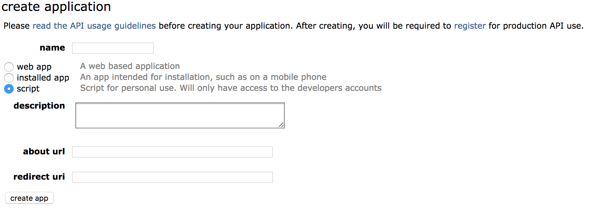
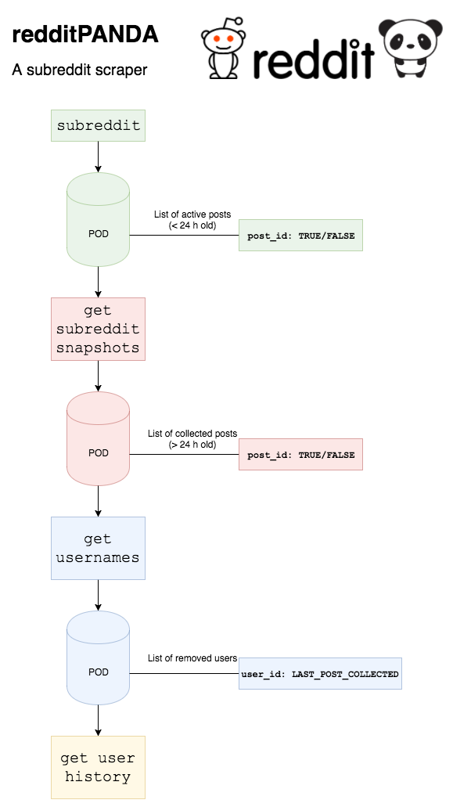

# redditPANDA
### *A subreddit scraper*

Author: @HSaleem :cat:

*NOTE: I am currently redesigning redditPANDA*

Last Push: Nov 22, 2017

## What redditPanda does

redditPanda is a tool for the continuous chronological scraping of a subreddit. It allows you to take the snapshots of the recent threads in a subreddit at specified time intervals. Panda watches each thread for 24 hours, keeping a copy of all the comments in it at the time of the snapshot.  

Therefore, redditPanda is a valuable tool to study the chornological growth of Reddit threads.

By default, redditPANDA takes a snapshot every 15 minutes. Once the collection of a post is complete (*post is now > 24 hours old*), redditPANDA extracts users with `[removed]` comments and starts to collect their history. 

## Getting Started

### Installing PRAW
redditPanda runs on PRAW. Therfore, before getting started, you need to install PRAW.

PRAW supports python 2.7, 3.3, 3.4, 3.5, and 3.6. The recommended way to install PRAW is via `pip`.

```
$ pip install praw
```

You can read more at `https://praw.readthedocs.io/en/latest/getting_started/installation.html`.

### Configuring Reddit
Before running Panda, you need to register with Reddit to obtain API keys. [Register](https://www.reddit.com/prefs/apps/) on Reddit with an appropriate applicaiton type. You need to have a Reddit account for registering an application.

For Panda go with Script Application.



You can name it what you want with an approproate description. The `about url` does not need to be populated.
While script applications do not involve a redirect uri, Reddit still requires that you provide one when registering your application – `http://localhost:8080` is a simple one to use. 

After registering, Reddit would provide you with `client id` (right under the name of your application inthe applications page) and `client secret`. Save these and do not share it with others.

### Setting up PRAW oAuth
In order to setup oAuth for Panda you need four pieces of information from Reddit:

Field | Description
--- | --- 
`client_id` | The client ID is the 14 character string listed just under "personal use script" for the desired developed application
`client_secret` | The client secret is the 27 character string listed adjacent to secret for the application.
`password` | The password for the Reddit account used to register the script application.
`username` | The username of the Reddit account used to register the script application.

Finally, you also need `user_agent`. Again, this field can be anything you want. Make sure it is descriptive, unique and contains your username. For example `A subreddit scraper by u/test`. 

Note: Panda runs in `read only` mode, providing access to Reddit like a logged out user.

## redditPANDA Architecture



### NOTE: 
Update the config file with relevant details before running.
Use the monitor script to fire off PANDA. monitor makes sure to restart PANDA if it crashers!

Moving to ssh from https
 
